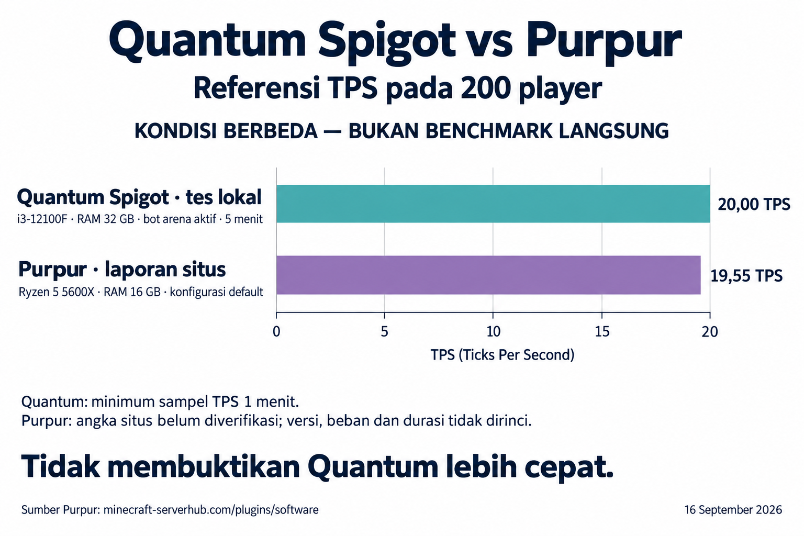

# Local active-player investigation — 2026-09-16

Status: **COMPLETE**. Quantum passed 200 and 250 scripted arena clients for
five measured minutes each with the pooled allocator. The local Purpur test
was cancelled at the operator's request, during login and before any measured
player stage. The completed exploration check found a separate chunk-generation
limit. This is not a claim of
200 unrestricted human players or long-term stability.

Machine: Intel Core i3-12100F, 4 cores / 8 logical processors, about 32 GiB RAM,
Windows 11 Enterprise, Microsoft OpenJDK 25.0.3+9. Server and native-protocol
bot clients share localhost. Server heap 1–6 GiB; driver heap 128 MiB–2 GiB.
Quantum 26.2 server SHA-256:
`92716c269abc8c1afb8c291b16481eaca40477e8918d17073fb4deb5ac8afa60`.
No added plugins, view distance 6, simulation distance 4, normal seeded world
728194 with a controlled survival arena above the terrain.

## Confirmed defects and changes

1. Quantum's TPS display treated the upstream array as `[1m, 5m, 15m]`.
   Bytecode inspection of this exact server confirmed that 26.2 returns
   `[5s, 1m, 5m, 15m]`. Source display and testbench parsing are corrected.
   Legacy logs remain unchanged; analysis corrects their labels explicitly.
   The changed command compiles against this exact runtime and its libraries.
   The active load runs intentionally used the unchanged pre-build artifact so
   allocator/configuration results stay comparable. A fresh complete build now
   passes; its packaged Quantum jar is
   `0B61BC71C1DB7EE4168DCBAA95206E939DA3FFFC70C2AA86070193231AFF09F7`.
2. A maximum driver scheduling delay from JVM warmup incorrectly failed an
   otherwise healthy measured interval. The driver now records warmup and
   measured maxima separately, retaining both in each result.
3. With bundled Spark active, JFR recorded a **7.8870148-second safepoint
   synchronization** (ID 18090). Its VM operation was `ThreadDump`, requested
   by `spark-java-sampler-2-thread-1`. Another 3.0639715-second synchronization
   (ID 27491) was requested by sampler thread 6. The longest GC pause in that
   diagnostic recording was 32.1 ms. This identifies profiler/JVM interference
   on this host, not a long GC collection or proof of a gameplay bottleneck.
4. The candidate configuration disables bundled Spark while retaining JFR and
   JVM safepoint logging. Gameplay distances, workload and the server binary
   remain the same. The performance gate also checks actual tick count divided
   by observed coverage and rejects individual ticks >=250 ms.
5. With Spark disabled but the locator bar enabled, 100 clients passed; 150
   reached worst rolling p95 59.90 ms and p99 81.80 ms despite displayed TPS 20.
   Waypoint frames appeared in 47.83% of sampled main-thread stacks at 150
   (34.53% at 100). Disabling `minecraft:locator_bar` reduced 150-client worst
   mean from 37.85 to 15.36 ms and worst p99 from 81.80 to 21.55 ms in the next
   run. This removes player-location markers above the hotbar, a real UI
   tradeoff. These are single-run observations, not a precise speedup claim.
6. With Spark and locator bar disabled, 200 clients passed five measured
   minutes: minimum 1m TPS 20, observed tick rate >=19.983/s, worst mean 21.99
   ms, p95 28.94 ms, p99 37.23 ms, maximum tick 61.60 ms, no disconnects.
   At 250 the server still reported TPS 20 but exhausted its 6 GiB direct
   memory limit in `AdaptiveByteBufAllocator`. Clients disconnected, so the
   full ramp **failed**. This must not be reported as a successful 250 test.
7. The next candidate uses `-Dio.netty.allocator.type=pooled`, retaining the
   same heap limit. This native option is documented in the
   [Netty 4.2 migration guide](https://github.com/netty/netty/wiki/Netty-4.2-Migration-Guide).
   The stack trace identifies the allocator path; it does not by itself prove
   a specific upstream leak. Retest results determine whether this is an
   effective mitigation for this workload.
   The pooled run completed the full ramp with no disconnects: native 1m TPS
   minimum 20 at 150/200/250; worst rolling mean 15.6/23.7/33.5 ms; maximum
   ticks 46.2/100.6/144.9 ms. Sampled server private memory stayed around
   2.4–2.5 GiB at 200/250. This is mitigation evidence for an 18-minute run,
   not proof of absence of all memory leaks. Native comparison commands expose
   no p95/p99; this pass uses the narrower comparison gate documented in the
   testbench README.
8. The 200-client creative exploration check ran with the same pooled allocator
   and correctly waited for chunks before moving. It recorded 401,800 movement
   packets, 395,772 successful exploration steps, 6,028 chunk-wait ticks and
   57,161 chunk packets received. The health stop triggered after sustained
   degradation. The final sampled 60-second window showed 12.41 one-minute
   TPS, 80.59 ms mean, p95 102.29 ms, p99 125.51 ms, max 157.10 ms and 8,074
   loaded chunks. The run shut down cleanly with no unexpected disconnects.
   This is the terrain-generation/streaming boundary on this host, not a
   client-rendering measurement.

## Workload and limits

Per ten bots: one idle, five walking/jumping, two placing and digging dirt,
one attacking a stationary high-health zombie, one opening/closing a chest
and swapping hotbar/offhand items. Some bots also chat and run `/list` at
ordinary intervals. Server-confirmed damage, block changes and chest opens
are checked separately from attempted actions. No position corrections are
allowed beyond a small diagnostic threshold.

This is controlled flat-floor survival, not unrestricted human gameplay.
It does not simulate farms, redstone, crafting, complete inventory transfers
or real PvP. A separate creative-flight scenario stresses chunk generation
and streaming. No 24-hour soak or matched local Purpur comparison has run.
For a public 200-player survival world, pregenerate the intended play area first;
that removes terrain-generation work during play but does not remove chunk
delivery, tracking, simulation, mobs, redstone or plugin load. The arena and
exploration results intentionally measure those two cases separately.

## Requested web-reference graphic

The operator cancelled local Purpur testing to save time and requested a web
reference instead. [Minecraft ServerHub](https://minecraft-serverhub.com/plugins/software)
reports Purpur at 19.55 TPS for 200 players on a Ryzen 5 5600X with 16 GB RAM,
NVMe storage and default configuration. Accessed 2026-09-16. The page does not
specify an exact Minecraft/build version, player behavior, duration, repetitions,
TPS aggregation or raw measurements. This publisher-reported value is **not
independently verified** and is not evidence about Purpur on the Quantum host.

Quantum's 20.00 is the minimum sampled one-minute TPS from the local five-minute
200-bot arena stage. Different machines, configurations and unspecified web
methodology prevent a relative-performance conclusion. No speedup percentage
or Purpur 250-player number is estimated. The image states these limits.
See [source data](2026-09-16-comparison-data.json) and the
[generation prompt](2026-09-16-chart-prompt.txt). The image was produced with
the built-in image generation tool and visually checked for values, bar scale
and disclosure. It is a reference infographic, not a matched benchmark.

## Runs and raw evidence

All run directories are under `C:\Users\skitt\.cache\quantumspigot\runs`.

| Directory suffix | Purpose | Observation |
|---|---|---|
| `smoke-2026-09-16T08-14-39-194Z-21cd7223` | Original 1/20 idle smoke | PASS; not active-player capacity evidence |
| `smoke-2026-09-16T08-23-01-184Z-bcd40b9d` | 20 active calibration | 20 TPS, worst rolling p99 8.58 ms; mob-damage acknowledgement collector subsequently corrected |
| `smoke-2026-09-16T08-27-50-222Z-82b141d0` | 50 active, Spark enabled | Driver warmup gate failed at 255.2 ms; server p99 <=12.95 ms in measured windows |
| `smoke-2026-09-16T08-33-18-630Z-b6405b8b` | 50/100 active, Spark enabled | FAIL; 7.911-second maximum tick at 50; long safepoints traced to Spark thread dumps |
| `smoke-2026-09-16T09-08-13-922Z-9174c70e` | Spark disabled, locator enabled | 50/100 PASS; 150 FAIL p99 81.80 ms; ramp stopped |
| `smoke-2026-09-16T09-23-17-171Z-3778702f` | Spark and locator disabled | 150/200 PASS; 250 FAIL due to direct-memory exhaustion |
| `smoke-2026-09-16T10-55-20-135Z-e1b6336c` | Same tuning, pooled allocator, common native metrics | PASS; 150/200/250, no disconnects; 200/250 five minutes each |
| `smoke-2026-09-16T11-01-25-022Z-dc807fce` | Matched Purpur baseline | CANCELLED by operator during login; no valid load result, not a performance failure |
| `smoke-2026-09-16T11-17-54-044Z-e0b045d4` | 200 creative explorers, pooled allocator | FAIL health gate; final 1m TPS 12.41, mean 80.59 ms, p99 125.51 ms; clean stop |

Each directory retains the manifest, server log, bot action logs, telemetry
and JFR. The long-stall directory also retains `stall-diagnostic.jfr`,
`stall-locks.json`, `stall-waits.json`, and `vm-operations.json` linking the
safepoint IDs to their callers.

Run `node quantum-testbench/scripts/analyze-run.mjs <directory>` after shutdown
for corrected window summaries and JFR hotspots. Rolling window percentiles
are not full-run percentiles and are never averaged together.
Sampling begins after 60 seconds of active warmup. Early rolling windows
still overlap that active warmup; they do not include join/setup. Driver
scheduling-delay maxima separate warmup exactly.
